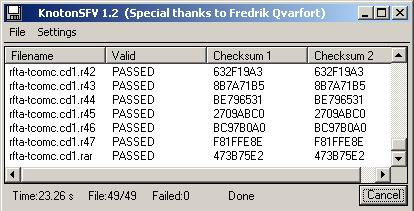



## KnotonSFV 1\.2

### Description

Calulate and validate Checksums in .SFV files using the CRC32 Algorithm.

All credits should go to Fredrik Qvarfort for providing the very fast solution to calculate CRC32 checksums with the help of Pre-compiled ASM. I just modified it a bit to let it calculate chunks of the file instead of the whole file, the rest is just a simple GUI for validating and creating .sfv files. I made this application when I got very tired of the commercial, slow and crappy SFV application I got. Just wanna share it with you to se an example of Fredrik Qvarfort great CRC32 alghoritm :-)

It is poorly documented that is why I put it as intermediate code experience level.... otherwise it should be fine for beginners with some experience.
 
### More Info
 

             |
---                |---
**Submitted On**   |2003-01-08 22:27:06
**By**             |[Knoton](https://github.com/Planet-Source-Code/PSCIndex/blob/master/ByAuthor/knoton.md)
**Level**          |Intermediate
**User Rating**    |4.0 (16 globes from 4 users)
**Compatibility**  |VB 6\.0
**Category**       |[Complete Applications](https://github.com/Planet-Source-Code/PSCIndex/blob/master/ByCategory/complete-applications__1-27.md)
**World**          |[Visual Basic](https://github.com/Planet-Source-Code/PSCIndex/blob/master/ByWorld/visual-basic.md)
**Archive File**   |[KnotonSFV\_1526251920\.zip](https://github.com/Planet-Source-Code/knoton-knotonsfv-1-2__1-42280/archive/master.zip)

